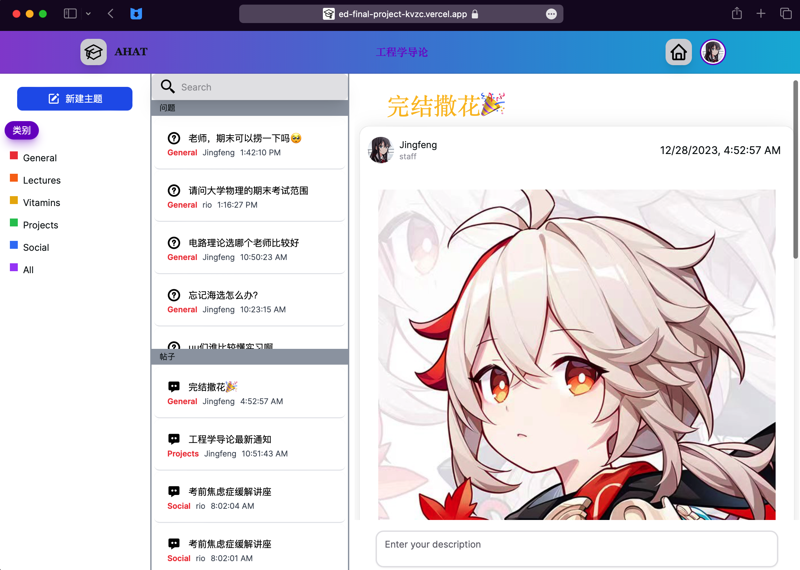
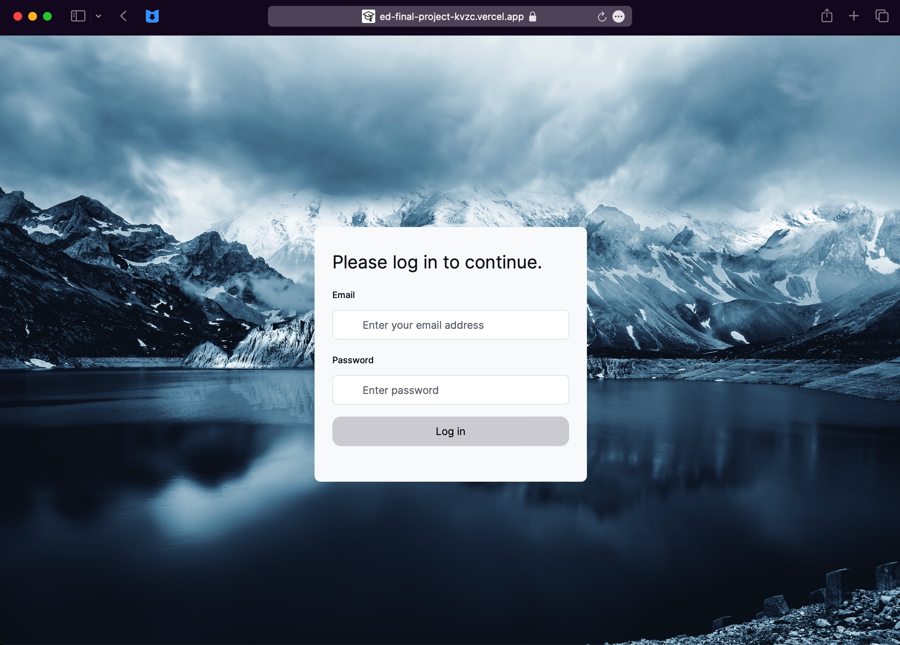
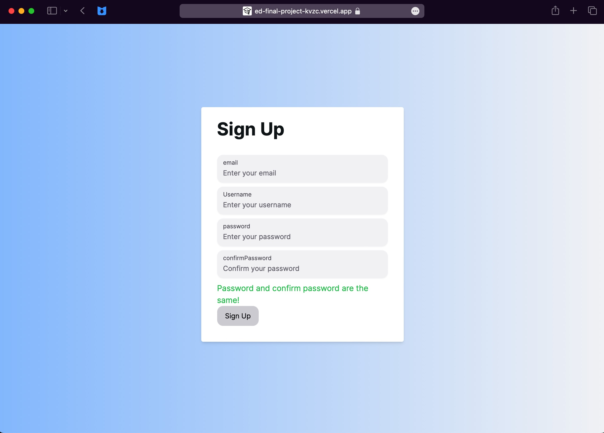
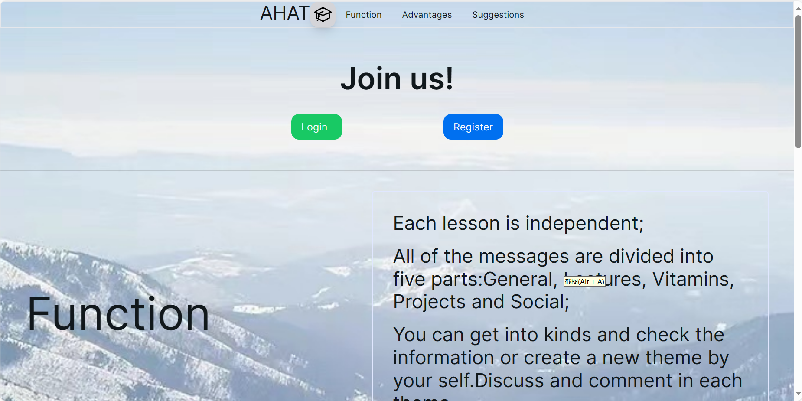

# AHAT Discussion

2023.12.28 上海交通大学 2023-2024-1 《工程学导论》项目答辩完结撒花😸

本项目创意来源于芝加哥大学的ed-discussion——一款课程管理网页系统，由于其高效便捷而被美国知名大学UCB与Stanford所使用。为使交大在师生交流软件方面也跻身世界一流大学行列，我们小组计划为交大量身定制一款名为AHAT Discussion的校园课程交流管理平台网页。

目前实现的功能：  
1) 网站的外观：包括主课程页面、注册登录页面、Enter入口页面，Profile个人资料页面
2) 注册与登录：目前能够检查输入的用户名是否为合法的邮箱格式，能够实现最为基础的注册账号与登录账号验证的功能，同时完成了数据库中对于密码的加密保存（hash）
3) 发帖与发评论：每个用户都可以发帖，可选择帖子类别，支持插入图片，每个帖子都有自己专属的url来作为其内容展示链接地址，而且是在同一个标签页内进行跳转；发评论目前支持发送文字
4) 筛选帖子：支持根据帖子类别来对帖子进行筛选与分类，能够使用搜索框搜索含keyword的标题
5) 个人信息修改：目前支持更改头像

待完善功能（这个得看有没有时间了😂）：
1) 可添加找回密码功能：期望功能是根据密保问题或者邮箱验证方式来找回密码，但邮箱找回有可能需要提供邮箱地址服务机构的权限
2) 添加课程功能：能够为不同的课程都添加一个讨论区、能够添加课程
3) 不同类型账号权限：区分账号类型为“管理员”、“教师”、“学生”、“行政老师”等，赋予每种账号以不同的功能
4) 发帖、回帖功能丰富化：除能够发送文字、图片外，期望能够添加链接、公式，支持Markdown等语法等个性化输入内容
5) 添加点赞功能：此前由于数据库以及后端知识所限，暂时想不出如何能够实现点赞赞数的统计以及用户对特定帖子/评论点赞状态保存的功能，期望后续能够学习数据库知识攻克难关
6) 切换页面样式功能：希望能够添加并调整样式，如暗色调等其他主题颜色风格
7) 页面进一步美化：针对目前尚未特别美观的地方进行修补
8) 网站的动态实时更新仍然略微缓慢，希望能够对标水源的帖子实时更新功能
9) 构思出更多的功能并完善它们

待优化方面：
1) 时差问题：我记得之前是修正过的，不知为何临近答辩时时间又不对了
2) 这网站可能没怎么顾及到性能优化，有时候打开比较慢
3) 会出现一些比较偶然的帖子发不出或者由于太卡了帖子重复发送的问题

### 1，网站一览
主课程界面

登录界面

注册界面

入口页面

### 2，开发栈
前端三件套：Html, CSS, Javascript    
前端框架提供者：Next.js（基于React.js）    
数据库方面：Postgresql 目前仅用到SQL语句 （感谢Vercel提供的远程数据库，免费的！）

期望后面或许在做更复杂功能的时候可以用到后端，如Java, SpringBoot等

### 3，致谢
感谢李军老师的肯定与支持！    
感谢各位组员的认真的投入，让我感受到小组作业不只有坑人的一带多或者各做各的互不干扰，而是大家共同为项目耗费心力，甚至有时会起一些冲突、经历一些挫折之类的。起了冲突才说明我们有在沟通交流，而最后大家又能够一次次地互相理解互相提建议，相互促进互相进步，的的确确是一种十分难能可贵的经历。毕竟是小组成员共同打磨的产品，自己做的东西就是不一样，大家在展示汇报的时候也可以感受到大家对于此次经历有十分深的感触，展示的效果也是遥遥领先，特别是JingfengS的乔布斯式PPT让我从质疑到服气，最后大家一起通力将此次展示做得非常好！！！      
小组成员的名字得征求他们意见才放出来😉

暂时就说这么多，项目具体细节懒得码了，后续可能会另开一个Markdown文件，全写在README好像也不太妥（其实就是懒）
